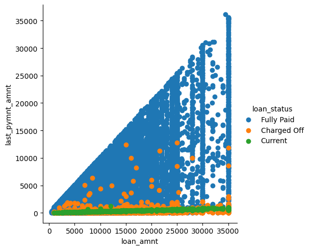

# Fraud Detection Exploratory Data Analysis

{: style="height:250px;width:500px" .center}

## Problem Statement

We can consider the bank as a risk-taker in loaning money to a customer. It’s the lender’s job to make sure that the borrower can repay the loan in a timely fashion. If they approved a loan, the lender must be certain the borrower can pay back the loan. If the applicant does not repay the loan, then the bank will suffer a financial loss. This is because the lender has to pay the amount that the borrower owes the lender. This is a good idea because the company wants to understand the driving factors behind the loan default. It can perform a loan loss analysis to identify the causes of bad loans. It’s likely that it can understand the factors which are powerful indicators of default by performing a credit investigation on individual borrowers, analyzing their financial circumstances, and identifying any negative factors.

You work for a consumer finance company that specializes in lending a variety of loans to urban customers.

Companies have to decide on loan approval based on the applicants’ profiles.

Two types of risks are associated with the bank’s decision:

A loss of business from the company that would otherwise have been awarded the loan;

Loss of reputation for the bank if the applicant cannot be persuaded to repay the loan.

He/she will probably default on their loan if they don’t pay it off, so it’s in their best interest to give it a go first.

The goal of the EDA was to visualize the loan attributes and consumer attributes that affect loan default.

A hypothesis test is used to discover trends, patterns, or to check assumptions with the help of statistical summaries and graphical representations.

If a person applies for a loan, there are two types of decisions that the company could take.

Loan accepted: a. if the company approves the loan, there are three scenarios described below: a. Fully paid: the applicant has fully paid the loan (the principal and the interest rate) b. Current: the applicant is paying the instalments. c. Charged-off: Applicant does not have enough funds available to pay the instalments on time. Applicant defaults on the loan.

Loan rejected: The company has rejected the loan (because the candidate does not meet their requirements, etc.).

## Exploratory Data Analysis

### Preliminary Data Observation
After we load the cvs file into a dataframe, the file constains 39717 rows and 111 columns.
``` py
print('The file constains {} rows and {} columns'.format(loan_df.shape[0],loan_df.shape[1]))
The file constains 39717 rows and 111 columns
```

The columns have the following data type as shown below.  We need to evaluate the 24 object columns as they are in the form of string and category. We confirm our observation by running, "loan_df.info()" function.  By setting verbose to True and show_counts to True, we also display the discrepancy between the total number of entries and missing data.  Then, we execute "loan_df.describe" to display descriptive statistic summary of count, mean, std, min, and max.
```
dtypes: float64(74), int64(13), object(24)
```

For columns in question, we want to verify their categories and unique values. For example, there are two terms in this dataset: 36 and 60 months.  
```
loan_df["term"].value_counts()
 36 months    29096
 60 months    10621
Name: term, dtype: int64
```
So far, we use basic functions such as .shape, .info(), .describe(), .value_counts, and .head() to help us see the data better.  Next, we want to determine whether the data contains any NULL. We can execute the function .isnull().sum() on an individual column or on an entire dataframe. In this example, we run it against emp_title.  As stated above, the file contains 39717 rows.  emp_title only has 2459 entries.  That means, it has a lot of missing data which we will need to decide later on whether to drop the entire column or imputate it with common statistical methods such as median.  In this case, emp_title does not add value to our exploratory data analysis.  Therefore, it is on of the columns among many that we will drop using loan_df.drop() function later on.
```
loan_df["emp_title"].isnull().sum()
2459
```


### Data Cleaning
When we execute dataframe.info() above, we observe there are 54 columns without values.  In that case, we need to drop them all.

```
loan_df = loan_df.drop(columns=['mths_since_last_major_derog','annual_inc_joint','dti_joint','verification_status_joint','tot_coll_amt','tot_cur_bal','open_acc_6m','open_il_6m','open_il_12m','open_il_24m','mths_since_rcnt_il','total_bal_il','il_util','open_rv_12m','open_rv_24m','max_bal_bc','all_util','total_rev_hi_lim','inq_fi','total_cu_tl','inq_last_12m','acc_open_past_24mths','avg_cur_bal','bc_open_to_buy','bc_util','mo_sin_old_il_acct','mo_sin_old_rev_tl_op','mo_sin_rcnt_rev_tl_op','mo_sin_rcnt_tl','mort_acc','mths_since_recent_bc','mths_since_recent_bc_dlq','mths_since_recent_inq','mths_since_recent_revol_delinq','num_accts_ever_120_pd','num_actv_bc_tl','num_actv_rev_tl','num_bc_sats','num_bc_tl','num_il_tl','num_op_rev_tl','num_rev_accts','num_rev_tl_bal_gt_0','num_sats','num_tl_120dpd_2m','num_tl_30dpd','num_tl_90g_dpd_24m','num_tl_op_past_12m','pct_tl_nvr_dlq','percent_bc_gt_75','tot_hi_cred_lim','total_bal_ex_mort','total_bc_limit','total_il_high_credit_limit'])
```
Now, we end up with fewer columns to work with. Earlier, we had 111 columns.  Now, we only have 49 columns left. We're making progress. Let's see what else we can do to clean up this data.
```
print('The file constains {} rows and {} columns'.format(loan_df.shape[0],loan_df.shape[1]))
The file constains 39717 rows and 49 columns
```
Next, we drop all columns that are not useful for our analysis.
```
loan_df = loan_df.drop(columns=['emp_title', 'pymnt_plan', 'url'])
loan_df.shape
(39717, 46)
```
### Data Manipulation
Our next step is to set the index.  We use id as it is unique.
```
loan_df = loan_df.set_index(["id"])
```
As part of data manipulation, we need to convert datatype and replace certain characters in order for us to perform arthmetic on the columns.  See example below:
```
loan_df.loan_amnt = loan_df.loan_amnt.astype("float64")
loan_df.int_rate = loan_df.int_rate.apply(lambda x: x.replace("%",""))
loan_df.revol_util = loan_df.revol_util.apply(lambda x:  "%" if pd.isnull(x) else x )
loan_df.revol_util = loan_df.revol_util.apply(lambda x:  x.replace("%","") )
loan_df['revol_util'] = pd.to_numeric(loan_df['revol_util'], errors='coerce')
```
Now, let's look at object datatype. We need to convert them to string. Here's an example of how to do that.
```
loan_df['grade'] = pd.Series(loan_df['grade'], dtype="string")
```
We touch upon missing data briefly before. Let's see what options we have with them. Run the following command to see sum of missing data for each column. That's quite a number of them.
```
loan_df.isnull().sum()
member_id                      0
loan_amnt                      0
funded_amnt                    0
funded_amnt_inv                0
term                           0
int_rate                       0
installment                    0
grade                          0
sub_grade                      0
emp_length                  1075
home_ownership                 0
annual_inc                     0
verification_status            0
issue_d                        0
loan_status                    0
desc                       12940
purpose                        0
title                         11
zip_code                       0
addr_state                     0
dti                            0
delinq_2yrs                    0
earliest_cr_line               0
inq_last_6mths                 0
mths_since_last_delinq     25682
mths_since_last_record     36931
open_acc                       0
pub_rec                        0
revol_bal                      0
revol_util                    50
total_acc                      0
out_prncp                      0
out_prncp_inv                  0
total_pymnt                    0
total_pymnt_inv                0
total_rec_prncp                0
total_rec_int                  0
total_rec_late_fee             0
recoveries                     0
collection_recovery_fee        0
last_pymnt_d                  71
last_pymnt_amnt                0
next_pymnt_d               38577
last_credit_pull_d             2
pub_rec_bankruptcies         697
dtype: int64
​
```
If they don't add value to our analysis, let's drop them.

### Bivariate Analysis
One of the simplest ways to analyze quantitative data is the bivariate analysis. A correlation study is an empirical research study that examines the relationship between two variables. Statistical analysis is used to determine if there is an association or relationship between the two variables. It determines if there’s a true effect that’s being tested. There are three important factors to consider when conducting a regression analysis. You need to identify the independent variable, the dependent variable, and the model that best fits the data. Bivariate analysis is a simple case of multivariate analysis. In fact, it’s just two variables.

Let's do a 2D plot to show loan status using loan_amnt vs last_pymnt_amnt. The legend on the right depicts the current status. More borrowers fully paid their loan as shown in blue. Charged Off scatters all over the chart as shown in orange. As for borrowers who are current on their payments are linear green line.

 ```
sns.FacetGrid(loan_df, hue = 'loan_status', size = 5).map(plt.scatter, 'loan_amnt', 'last_pymnt_amnt').add_legend();
```

{: style="height:350px;width:350px"}

Let's see how interest rate impact loan payments.
