# Lending Club Data Analysis

{: style="height:250px;width:500px" .center}

## Problem Statement

We can consider the bank as a risk-taker in loaning money to a customer. It’s the lender’s job to make sure that the borrower can repay the loan in a timely fashion. If they approved a loan, the lender must be certain the borrower can pay back the loan. If the applicant does not repay the loan, then the bank will suffer a financial loss. This is because the lender has to pay the amount that the borrower owes the lender. This is a good idea because the company wants to understand the driving factors behind the loan default. It can perform a loan loss analysis to identify the causes of bad loans. It’s likely that it can understand the factors which are powerful indicators of default by performing a credit investigation on individual borrowers, analyzing their financial circumstances, and identifying any negative factors.

You work for a consumer finance company that specializes in lending a variety of loans to urban customers.

Companies have to decide on loan approval based on the applicants’ profiles.

Two types of risks are associated with the bank’s decision:

A loss of business from the company that would otherwise have been awarded the loan;

Loss of reputation for the bank if the applicant cannot be persuaded to repay the loan.

He/she will probably default on their loan if they don’t pay it off, so it’s in their best interest to give it a go first.

The goal of the EDA was to visualize the loan attributes and consumer attributes that affect loan default.

A hypothesis test is used to discover trends, patterns, or to check assumptions with the help of statistical summaries and graphical representations.

If a person applies for a loan, there are two types of decisions that the company could take.

Loan accepted: a. if the company approves the loan, there are three scenarios described below: a. Fully paid: the applicant has fully paid the loan (the principal and the interest rate) b. Current: the applicant is paying the instalments. c. Charged-off: Applicant does not have enough funds available to pay the instalments on time. Applicant defaults on the loan.

Loan rejected: The company has rejected the loan (because the candidate does not meet their requirements, etc.).

## Exploratory Data Analysis

### Preliminary Data Observation
After we load the cvs file into a dataframe, the file constains 39717 rows and 111 columns.
``` py
print('The file constains {} rows and {} columns'.format(loan_df.shape[0],loan_df.shape[1]))
The file constains 39717 rows and 111 columns
```

The columns have the following data type as shown below.  We need to evaluate the 24 object columns as they are in the form of string and category. We confirm our observation by running, "loan_df.info()" function.  By setting verbose to True and show_counts to True, we also display the discrepancy between the total number of entries and missing data.  Then, we execute "loan_df.describe" to display descriptive statistic summary of count, mean, std, min, and max.
```
dtypes: float64(74), int64(13), object(24)
```

For columns in question, we want to verify their categories and unique values. For example, there are two terms in this dataset: 36 and 60 months.  
```
loan_df["term"].value_counts()
 36 months    29096
 60 months    10621
Name: term, dtype: int64
```
So far, we use basic functions such as .shape, .info(), .describe(), .value_counts, and .head() to help us see the data better.  Next, we want to determine whether the data contains any NULL. We can execute the function .isnull().sum() on an individual column or on an entire dataframe. In this example, we run it against emp_title.  As stated above, the file contains 39717 rows.  emp_title only has 2459 entries.  That means, it has a lot of missing data which we will need to decide later on whether to drop the entire column or imputate it with common statistical methods such as median.  In this case, emp_title does not add value to our exploratory data analysis.  Therefore, it is on of the columns among many that we will drop using loan_df.drop() function later on.
```
loan_df["emp_title"].isnull().sum()
2459
```


### Data Cleaning
When we execute dataframe.info() above, we observe there are 54 columns without values.  In that case, we need to drop them all.

```
loan_df = loan_df.drop(columns=['mths_since_last_major_derog','annual_inc_joint','dti_joint','verification_status_joint','tot_coll_amt','tot_cur_bal','open_acc_6m','open_il_6m','open_il_12m','open_il_24m','mths_since_rcnt_il','total_bal_il','il_util','open_rv_12m','open_rv_24m','max_bal_bc','all_util','total_rev_hi_lim','inq_fi','total_cu_tl','inq_last_12m','acc_open_past_24mths','avg_cur_bal','bc_open_to_buy','bc_util','mo_sin_old_il_acct','mo_sin_old_rev_tl_op','mo_sin_rcnt_rev_tl_op','mo_sin_rcnt_tl','mort_acc','mths_since_recent_bc','mths_since_recent_bc_dlq','mths_since_recent_inq','mths_since_recent_revol_delinq','num_accts_ever_120_pd','num_actv_bc_tl','num_actv_rev_tl','num_bc_sats','num_bc_tl','num_il_tl','num_op_rev_tl','num_rev_accts','num_rev_tl_bal_gt_0','num_sats','num_tl_120dpd_2m','num_tl_30dpd','num_tl_90g_dpd_24m','num_tl_op_past_12m','pct_tl_nvr_dlq','percent_bc_gt_75','tot_hi_cred_lim','total_bal_ex_mort','total_bc_limit','total_il_high_credit_limit'])
```
Now, we end up with fewer columns to work with. Earlier, we had 111 columns.  Now, we only have 49 columns left. We're making progress. Let's see what else we can do to clean up this data.
```
print('The file constains {} rows and {} columns'.format(loan_df.shape[0],loan_df.shape[1]))
The file constains 39717 rows and 49 columns
```
Next, we drop all columns that are not useful for our analysis.
```
loan_df = loan_df.drop(columns=['emp_title', 'pymnt_plan', 'url'])
loan_df.shape
(39717, 46)
```
### Data Manipulation
Our next step is to set the index.  We use id as it is unique.
```
loan_df = loan_df.set_index(["id"])
```
As part of data manipulation, we need to convert datatype and replace certain characters in order for us to perform arthmetic on the columns.  See example below:
```
loan_df.loan_amnt = loan_df.loan_amnt.astype("float64")
loan_df.int_rate = loan_df.int_rate.apply(lambda x: x.replace("%",""))
loan_df.revol_util = loan_df.revol_util.apply(lambda x:  "%" if pd.isnull(x) else x )
loan_df.revol_util = loan_df.revol_util.apply(lambda x:  x.replace("%","") )
loan_df['revol_util'] = pd.to_numeric(loan_df['revol_util'], errors='coerce')
```
Now, let's look at object datatype. We need to convert them to string. Here's an example of how to do that.
```
loan_df['grade'] = pd.Series(loan_df['grade'], dtype="string")
```
We touch upon missing data briefly before. Let's see what options we have with them. Run the following command to see sum of missing data for each column. That's quite a number of them.
```
loan_df.isnull().sum()
member_id                      0
loan_amnt                      0
funded_amnt                    0
funded_amnt_inv                0
term                           0
int_rate                       0
installment                    0
grade                          0
sub_grade                      0
emp_length                  1075
home_ownership                 0
annual_inc                     0
verification_status            0
issue_d                        0
loan_status                    0
desc                       12940
purpose                        0
title                         11
zip_code                       0
addr_state                     0
dti                            0
delinq_2yrs                    0
earliest_cr_line               0
inq_last_6mths                 0
mths_since_last_delinq     25682
mths_since_last_record     36931
open_acc                       0
pub_rec                        0
revol_bal                      0
revol_util                    50
total_acc                      0
out_prncp                      0
out_prncp_inv                  0
total_pymnt                    0
total_pymnt_inv                0
total_rec_prncp                0
total_rec_int                  0
total_rec_late_fee             0
recoveries                     0
collection_recovery_fee        0
last_pymnt_d                  71
last_pymnt_amnt                0
next_pymnt_d               38577
last_credit_pull_d             2
pub_rec_bankruptcies         697
dtype: int64
​
```
The following date columns need specialist handling. We prepend “01-“ before we can convert to datetime. Once the dtype is in datetime, we can parse out month and year.

### Data Imputation
We imputate categorical data that has missing values using mode. For missing numerical data, we use mean. If there are outliers, it’s best to use median for numerical data. This will exclude the outliers. Below are examples for both scenarios.

```
loan_df["emp_length"].fillna(loan_df["emp_length"].mode()[0], inplace=True)
loan_df.pub_rec_bankruptcies.median()
```

We try determine if an applicant will default or not. loan_status column is our target variable which has three values: Fully Paid, Charged Off, and Current. We can drop Current. However, we need to convert the former two into 1 and 0 as machine can only understand binary. We must do this first even though we’re not training machine learning model at this time.

```
loan_df["loan_default"] = loan_df["loan_status"].apply(lambda x: 0 if x == "Fully Paid" else 1)
```

### Handling Outliers
Before we perform any kind of analysis, we must get rid of outliers first. Try not to get rid of too much data. Use boxplot and histogram to visualize the appropriate cutoff point.

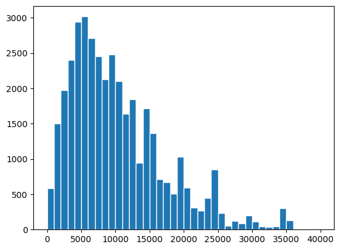{: style="height:250px;width:250px" .center} 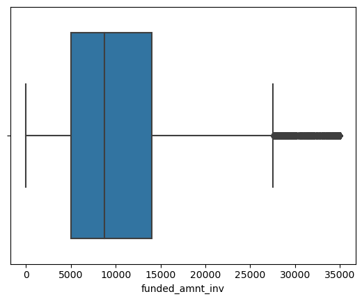{: style="height:250px;width:250px" .center}

Once we complete data cleansing, data manipulation, data imputation, and handling of outliers, we can proceed to Data Analysis next.

### Data Analysis
#### Univariate Analysis
Univariate analysis refers to a type of data analysis that looks at data in one variable. So, uni refers to “one”. It does not deal with causes or relationships (unlike regression) and its major purpose is to describe, summarize, and find patterns in the data. In univariate analysis, a variable is just a condition or subset that your data falls into. This is a concept that was developed by the National Weather Service. It provides a single number that represents how likely a particular storm is to occur in any given day, week, month, or year.

We try to find the strongest predictos for all categorical variables compared to the target variable (loan_default). As stated above, we label Fully Paid as 0 and Charged Off (Default) as 1.

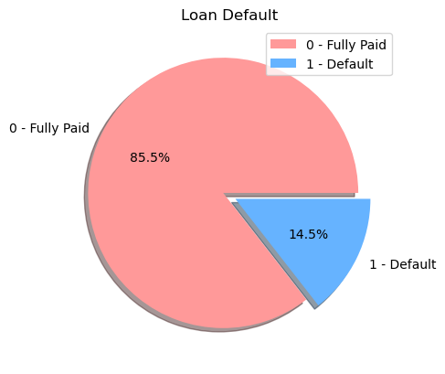{: style="height:250px;width:250px" .center}

We want to find the strongest predictors for the 14.5% Default. Want to focuse on:

```
'term','grade','sub_grade','emp_length','home_ownership','verification_status','purpose','zip_code','addr_state','issue_d','issue_month','issue_year'
```

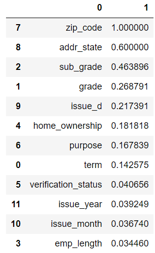{: style="height:350px;width:250px" .center}

As depicted above, zip_code, addr_state, sub_grade, grade, issue_d are the top five univariables to focus on. For the purpose of this case study, we ignore PII data.

##### Zip Code
Loans approved for the below eight zip codes defaulted 100% of the time. Approving loan applications for these zip codes is a huge risk.

```
[‘094xx’, ‘373xx’, ‘385xx’, ‘669xx’, ‘689xx’, ‘833xx’, ‘999xx’,’998xx’]
```

##### Address State
Loans approved for the states WY and DC has lesser percentage of loan defaults, 6% and 4% respectively. Approving loan applications for these states has less risk. Also, IA, IN and ME have no loan defaults; although only a small percentage of loan applications are from these states. Approving loan applications from these states also has lesser risk.

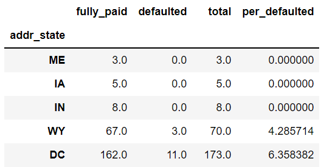{: style="height:200px;width:200px" .center}


##### Sub-grade
Loans approved for the sub-grade levels F5 (49%) and G5 (43%) have very high risk. 49% and 43% of loans for each respective sub-grade defaulted.

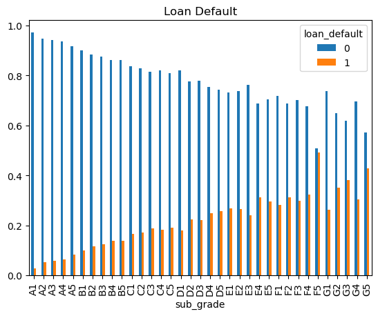{: style="height:300px;width:300px" .center}

##### Grade
Loans approved for the grade levels F and G are very high risk as 32% and 33% of loans are defaulted.

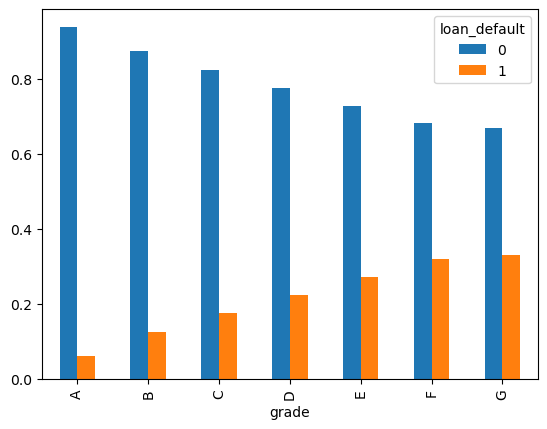{: style="height:300px;width:300px" .center}

##### Issue Date
Loan ussed in the month of September has a default rate of 16% Issue Date

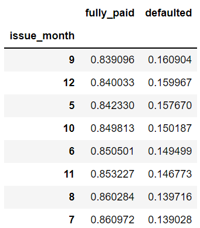{: style="height:300px;width:300px" .center}

##### Home Ownership
Home Ownership is a strong predictor. Loans approved for the home ownership category OTHER and RENT have high risk of default at 18% and 15% respectively. Loan for MORTGAGE only has default rate of 13%.

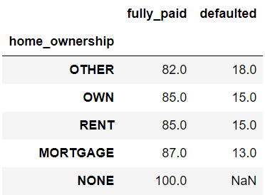{: style="height:300px;width:300px" .center}

##### Purpose
27% of loans made to small busness defaulted. The second highest default is for renewable engergy.

```
purpose = round(loan_df.groupby('purpose')["loan_default"].value_counts(1).unstack() *100, 2)
purpose.columns=["fully_paid","defaulted"]
purpose
purpose.sort_values(by="defaulted", ascending=False)
```

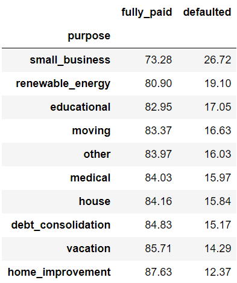{: style="height:300px;width:300px" .center}

##### Term
Terms have 36 and 60 months. Out of the two, long-term loan (60 months) has a higher right of default.

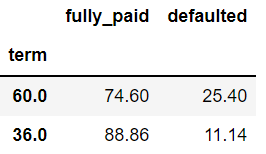{: style="height:150px;width:150px" .center}


##### Verification Status
Verification status is about the same whether you do it or not. It’s not a strong predictive indicator.

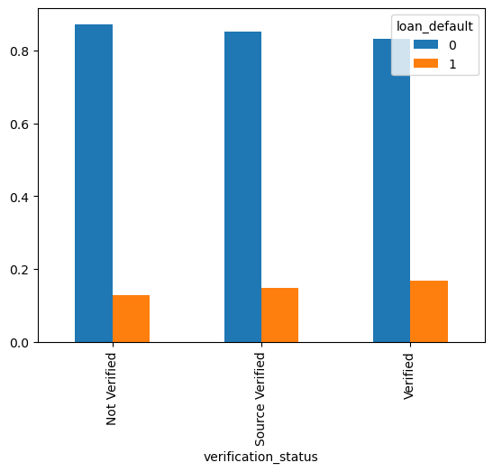{: style="height:350px;width:350px" .center}

##### Length of Employment
Length of employment is not a strong indicator either. It varies between 13% and 15% for nine years under observation.

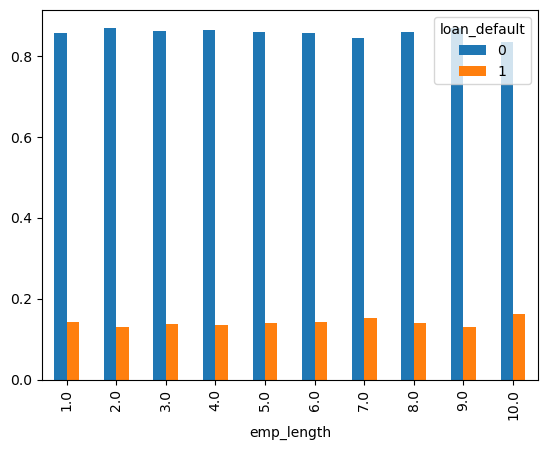{: style="height:350px;width:350px" .center}

##### Funded Amount Investor
Applicants who borrow between 20833 and 25000 encounter the highest default rate of 24.81%

```
print(round(loan_df.groupby('funded_amnt_inv_bin')["loan_default"].value_counts(1).unstack()*100,2))

loan_default                0      1
funded_amnt_inv_bin                 
(-25.0, 4166.667]       85.01  14.99
(4166.667, 8333.333]    86.82  13.18
(8333.333, 12500.0]     87.08  12.92
(12500.0, 16666.667]    84.16  15.84
(16666.667, 20833.333]  82.12  17.88
(20833.333, 25000.0]    75.19  24.81
```

##### Annual Income
Loan given to applicant is less than $12,006 annual income has the highest default rate or 25%

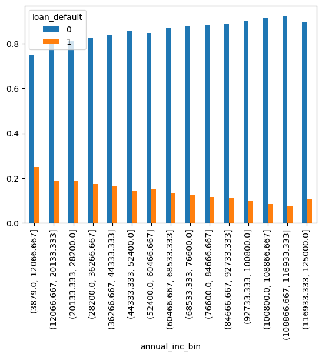{: style="height:350px;width:350px" .center}


##### Interest Rate
Interest Rate is a strong predictor. Loans approved for the interest greater than 20% is a high risk, as 40% of the loans defaulted.

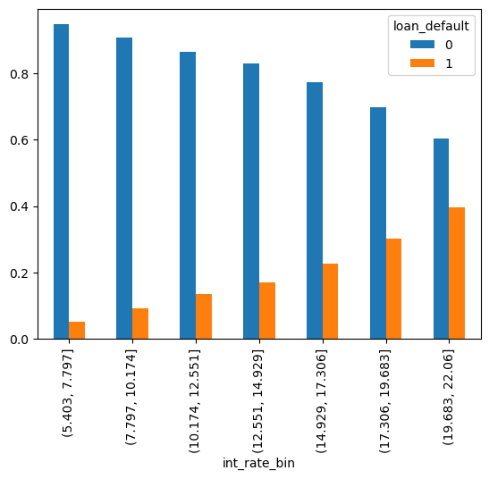{: style="height:350px;width:350px" .center}

##### DTI
There is a 17% default rate when debt to income ratio is between 21% and 24%.

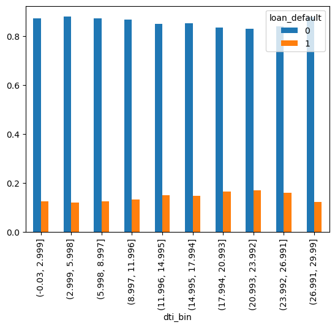{: style="height:350px;width:350px" .center}


#### Bivariate Analysis
One of the simplest ways to analyze quantitative data is the bivariate analysis. A correlation study is an empirical research study that examines the relationship between two variables. Statistical analysis is used to determine if there is an association or relationship between the two variables. It determines if there’s a true effect that’s being tested. There are three important factors to consider when conducting a regression analysis. You need to identify the independent variable, the dependent variable, and the model that best fits the data. Bivariate analysis is a simple case of multivariate analysis. In fact, it’s just two variables.

Let’s do a 2D plot to show loan status using loan_amnt vs last_pymnt_amnt. The legend on the right depicts the current status. More borrowers fully paid their loan as shown in blue. Charged Off scatters all over the chart as shown in orange. As for borrowers who are current on their payments are linear green line.

For bivariate analysis, we focus on:

- Grade & Interest Rate
- Funded Amount by Investor & DTI
- Annual Income and Grade
- Annual Income and Funded Amount by Investors
- Funded Amount by Investors, Annual Income & Grade
- Address State and Funded Amount by Investors & Annual Income
- Analyze Sub Grade and Annual Income
- Analyze Annual Income & DTI
- Analyze Employee Length and Funded Loan Amount by Investors
- Analyze Loan Issued Year and Interest Rate


##### Grade & Interest Rate
Grade E & F with interest rate between 19.68 and 22.06 have a default rate of 43% and 41% - respectively. Also, Grade B , C, D, E with interest rate between 5.40 and 7.79 are 100% Fully Paid. Approving loans for the latter categories is good for business.

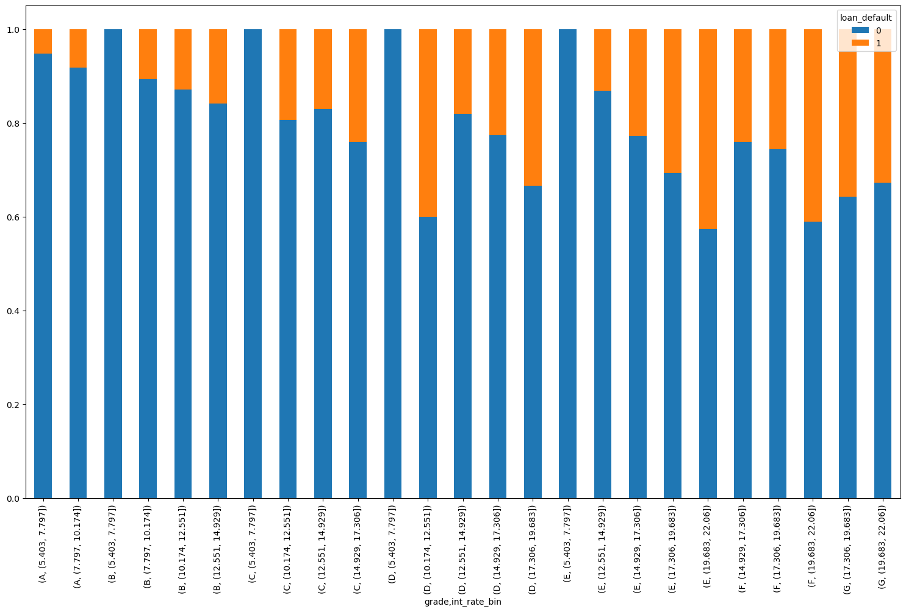{: style="height:350px;width:450px" .center}


##### Funded Amount by Investor & DTI
Amount funded by investors between $20833.33 and $25000.00 to applicants with DTI of 5.99 to 8.99 have a 29% default rate.

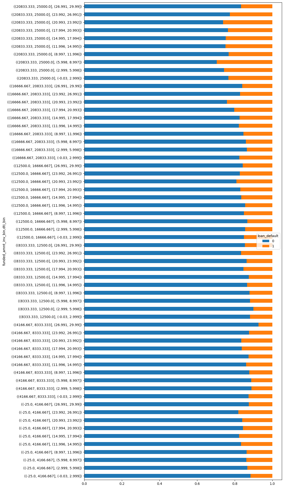{: style="height:950px;width:750px" .center}

##### Annual Income and Grade
Approving G Grade loans to applicants with an annual salary of less than $24166.66 is very high risk as 57% of loans defaulted.

{: style="height:150px;width:250px" .center}

##### Annual Income and Funded Amount by Investors
Approving loans with fund between $20833 and $25000 to applicants getting salary between $28200 and $36266 is a high risk as 78% of loans defaulted.

```
loan_df.groupby(['annual_inc_bin','funded_amnt_inv_bin'])["loan_default"].value_counts(1).unstack().sort_values('funded_amnt_inv_bin').plot(kind="barh",figsize=(10.5,25.5), stacked=True);
```

{: style="height:150px;width:350px" .center}

##### Funded Amount by Investors, Annual Income & Grade
If the Loan Amount is greater than $20833 and if the applicants salary is less than $34250, then do not approve the loan with grades C or above.

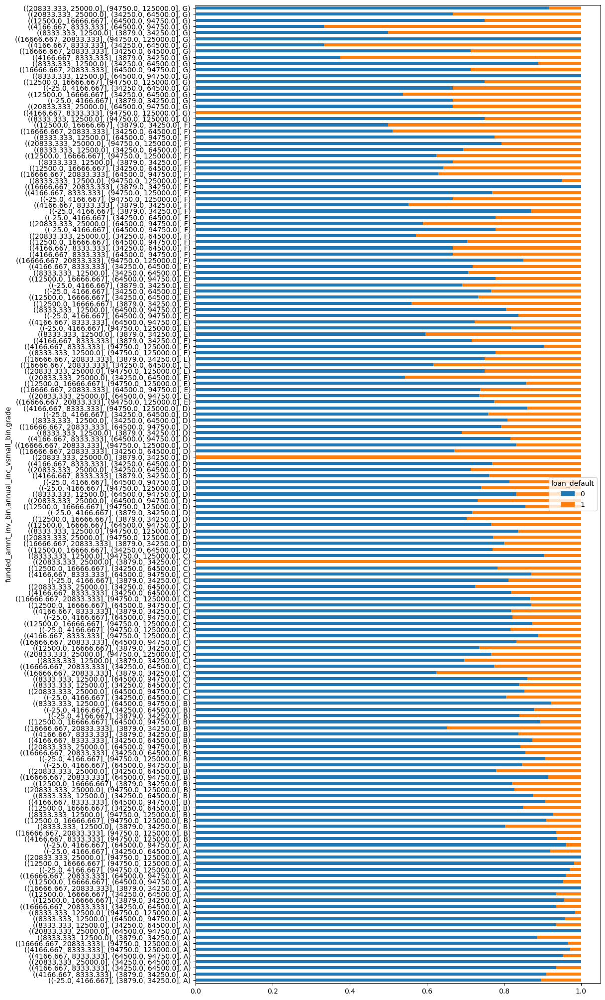{: style="height:850px;width:950px" .center}


##### Address State and Funded Amount by Investors & Annual Income
Do not approve loans with the following conditions:

- [x] When State is WA, loan amount requested is greater than 16666 and annual income is less than 34250
- [x] When State is VA, loan amount requested is greater than 16666 and annual income is less than 34250
- [x] When State is SC, loan amount requested is greater than 16666 and annual income is less than 34250
- [x] When State is NJ, loan amount requested is greater than 16666 and annual income is less than 34250
- [x] When State is NC, loan amount requested is greater than 20833 and annual income is less than 34250
- [x] When State is MD, loan amount requested is greater than 16666 and annual income is less than 34250
- [x] When State is DC, loan amount requested is greater than 12500 and annual income is less than 34250
- [x] When State is AZ, loan amount requested is greater than 16666 and annual income is less than 34250

See code below:
```
loan_df.groupby(['addr_state','funded_amnt_inv_bin','annual_inc_vsmall_bin'])["loan_default"].value_counts(1).unstack().plot(kind="barh",figsize=(10.5,150), stacked=True);
```

##### Analyze Sub Grade and Annual Income
When loan Sub-Grade is G3 and the annual income is less than 34250, there is a 100% default

{: style="height:1550px;width:550px" .center}

##### Analyze Annual Income & DTI
Annual Income with DTI ratio didn't have a big impact in loan default

```
loan_df.groupby(['annual_inc_bin','dti_bin'])["loan_default"].value_counts(1).unstack().plot(kind="barh",figsize=(10.5,25.5), stacked=True);
```

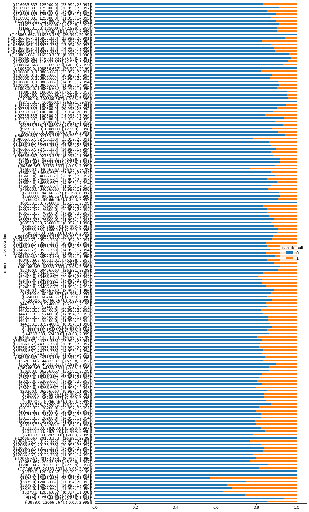{: style="height:1550px;width:550px" .center}

##### Analyze Employee Length and Funded Loan Amount by Investors
Employee Length with Funded Loan Amount by Investors didn't have a big impact in loan default

```
loan_df.groupby(['emp_length','funded_amnt_inv_bin'])["loan_default"].value_counts(1).unstack().plot(kind="barh",figsize=(10.5,25.5), stacked=True);
```

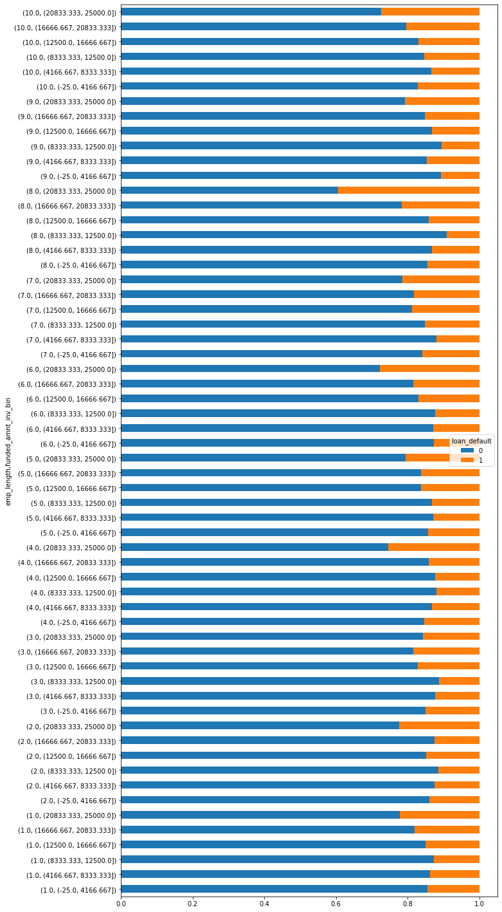{: style="height:1550px;width:550px" .center}

##### Analyze Loan Issued Year and Interest Rate

```
loan_df.groupby(['issue_year','int_rate_bin'])["loan_default"].value_counts(1).unstack().plot(kind="barh",figsize=(10.5,25.5), stacked=True);
```
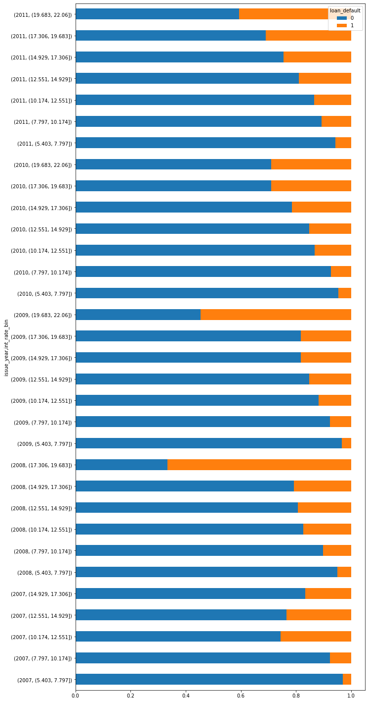{: style="height:1550px;width:550px" .center}

There are several observations being made from this data point:

1. Except for 2007, the number of defaults grow linearly with respect to increase in the interest rate.
2. In 2008, a new interest rate maximum is introduced (19.683% ), that year the loan default in this range is 67%
3. In 2009, a new interest rate maximum is introduced (22.060%), that year the loan default in this range is 55%

So, whenever a new interest rate maximum is introduced, if the approval of the loan applications with this new interest rate is minimal, then the number of loan defaults can be minimized.

## Recommendations
Based on our analysis, we come up with the following recommendations.  This is based on the limited dataset we have. As new data is gathered, we need to reevaluate the model due to both data and model drifting affect.

- [x] If the Loan Amount is greater than 20833 and the loan grade is C or D or E or F or G and the applicants salary is less than 34250 then do not approve.

- [x] When a new maximum interest rate is introduced in a year, minimize the approval of loan applications in this interest rate so as to minimize the number of loan defaults.

- [x] If the Loan grade is B or C or D or E with Interest rate between 5.403 and 7.797, then approve the loan. Do not approve loans with the following conditions:

- [x] Applicants reside in WA, VA, SC, NJ, MD, and AZ who request for loan amount of $16,666 and have annual income of $34,250.
- [x] Applicants reside in NC who request for loan amount of $20,833 and have annual income of $34,250.
- [x] Applicants reside in DC who request for loan amount of $12,500 have annual income of $34,250.

## Conclusion
Making affective decision on when and when not to approve loan applications is paramount to the lending club's survival. We use statistical, univariate, and bivariate analysis to identify strong predictive variables to guide our decision making process. To get there, we need to first load the data, perform exploratory data analysis, clean the data, and handle missing data with imputation or simply drop them if there no or very value from the columns. Next, we perform univariate and bivariate analysis. This includes performing data visualization to help us quickly see our data. At the end, we discover six strong predictive variables that can aid with our loan approval process.  These variables are Funded Loan Amount by Investors, Annual Income, Interest Rate, Grade, Sub-grade, and Issue Date.  Approving loan based on these six data point lessen the risk of being default.

Disclaimer: This use case does not factor in local governance which includes personal identified information and demographic data that might be considered as “bias”. In production environment, we need to remove "bias" data points to avoid unintentional discrimination against any applicants.
